# utar_freshman_survival_guide
This is university assignment. It is a python application that calculate the distance and time travel based on location and transportation

* [homepage](#homepage)
* [userpage](#userpage)
  * [locationselectionpage](locationselectionpage)
  * [distanceresultpage](distanceresultpage)
  * [transportationselectionpage](transportationselectionpage)
  * [timetravelresultpage](timetravelresultpage)
* [adminpage](adminpage)
  * [addplacepage](addplacepage)
  * [addtransportationpage](addtransportationpage)
  * [adduserpage](adduserpage)
  * [deleteplacepage](deleteplacepage)
  * [deletetransportpage](deletetransportpage)
  * [deleteuserpage](deleteuserpage)

<a name="homepage">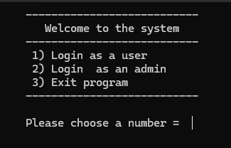</a>
<a name="userpage">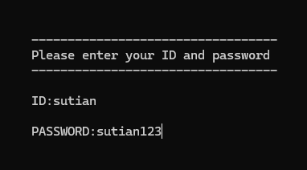</a>
<a name="locationselectionpage">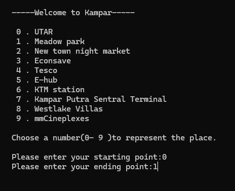</a>
<a name="distanceresultpage">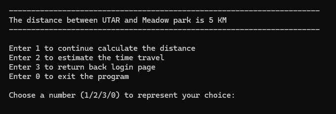</a>
<a name="transportationselectionpage">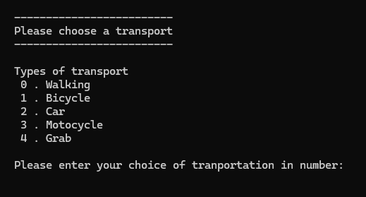</a>
<a name="timetravelresultpage">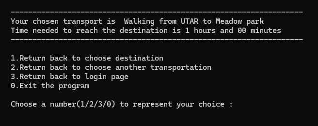</a>
<a name="adminpage">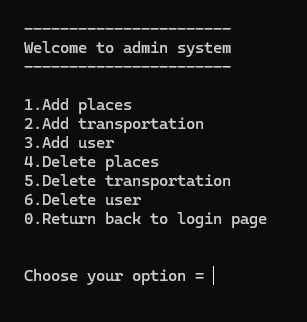</a>
<a name="addplacepage">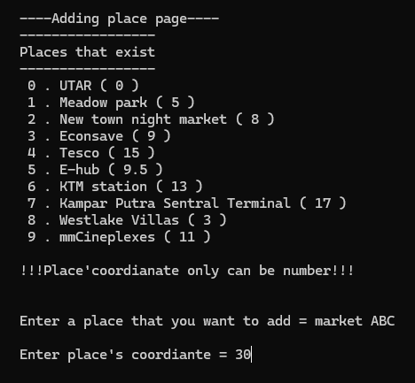</a>
<a name="addtransportationpage">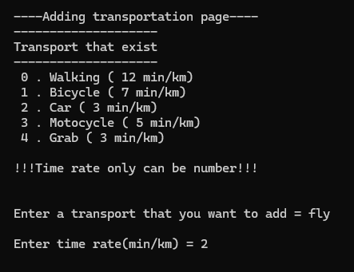</a>
<a name="adduserpage">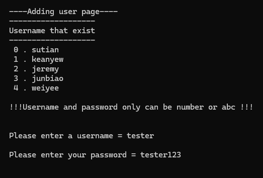</a>
<a name="deleteplacepage">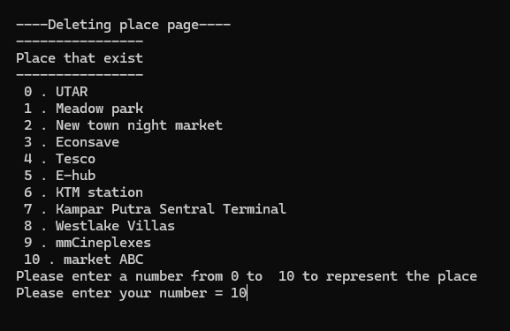</a>
<a name="deletetransportpage">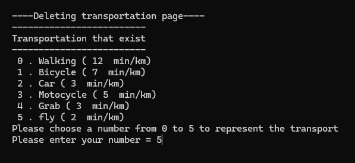</a>
<a name="deleteuserpage">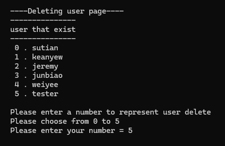</a>
